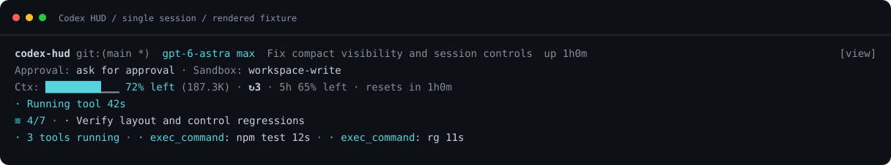
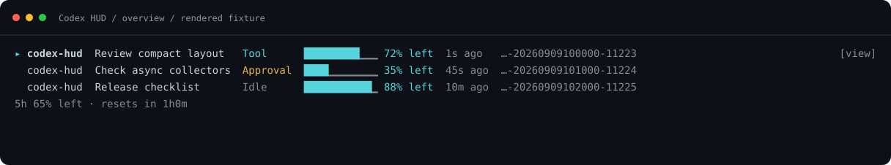

<p align="center">
  <a href="./README.md"></a>
  <a href="./README.zh.md"></a>
  <a href="./README.ja.md"></a>
  <a href="./README.ko.md"></a>
</p>

# Codex HUD

> **참고:** 이 한국어 문서는 2026-08-04 시점의 내용입니다. 2026-08 이후의 변경(턴 실패 표시, `/new` 감지, 알림 훅, 할당량 예측, 마우스 조작, 내용에 맞춘 창 높이 등)은 영어 [README.md](./README.md)와 중국어 [README.zh.md](./README.zh.md)에만 반영되어 있습니다.

[OpenAI Codex CLI](https://github.com/openai/codex)를 위한 실시간 상태 표시줄 HUD. 경량, 무설정, tmux 내 동작.

제어 명령은 현재 tmux pane의 세션을 우선합니다. tmux 밖에서는 현재 디렉터리의 후보가 하나일 때만 자동 선택합니다. 여러 후보가 있으면 `--target 세션이름` 또는 `--target %pane번호`를 지정하세요. 클릭 전환은 화면의 `[view]` 버튼에서만 가능합니다. `Last call`은 마지막 모델 요청, `Total`은 세션 누계입니다.

## Windows WSL 지원

Windows 지원은 Ubuntu WSL을 통해 `feature/windows-support-dual-entry` branch에서 제공됩니다. macOS/Linux 사용자는 `main`을, Windows (WSL) 사용자는 해당 feature branch를 사용하세요.

> Claude Code의 [claude-hud](https://github.com/jarrodwatts/claude-hud)에서 영감을 받았습니다.



## 왜 Codex HUD가 필요한가요?

**Q: Codex CLI만으로 충분하지 않나요?**

계기판 없이 비행하는 것과 같습니다. Codex HUD는 터미널 하단에 상시 대시보드를 제공합니다:

- **브랜치, 모델, 권한** — 한눈에 파악, 추측 불필요
- **Token 사용량 (cache 포함)** — 컨텍스트 소비량을 정확히 파악
- **Context 윈도우 채움 바** — 한계에 가까워지면 즉시 인지
- **MCP 서버 상태 & 도구 호출** — Codex가 실제로 무엇을 하는지 모니터링
- **Reasoning effort 레벨** — 현재 사고 깊이 표시

**Q: 여러 Codex 세션을 동시에 모니터링할 수 있나요?**

네. HUD pane을 클릭한 뒤 `Ctrl+T`를 누르거나 main pane에서 `codex-hud --toggle-mode`를 실행하면 **멀티 세션 개요 모드**로 전환할 수 있습니다.



**Q: tmux를 수동으로 설정해야 하나요?**

아닙니다. Codex HUD가 tmux를 자동으로 활성화합니다. `codex`만 입력하면 HUD가 나타납니다. tmux가 설치되지 않은 경우에도 설치 프로그램이 처리합니다.

## 빠른 시작

### macOS/Linux (`main`)

```bash
git clone https://github.com/fwyc0573/codex-hud.git
cd codex-hud
git switch main
./bin/codex-hud-install

# 셸을 새로고침한 후 입력:
codex
```

### Windows (WSL) (`feature/windows-support-dual-entry`)

```powershell
git clone https://github.com/fwyc0573/codex-hud.git
cd codex-hud
git switch feature/windows-support-dual-entry
.\bin\codex-hud-install.ps1

# 새 PowerShell 또는 cmd 창을 열고 확인:
codex --self-check

# WSL HUD로 실행:
codex
```

### 관리 명령어

첫 설치 후 다음 명령어가 셸에 추가됩니다:

| 명령어 | 설명 |
|--------|------|
| `codex-hud-sync` | 현재 체크아웃을 다시 빌드하고 별칭 갱신 |
| `codex-hud-upgrade` | 현재 추적 브랜치를 격리 빌드한 뒤 성공하면 fast-forward하고 별칭 갱신 |
| `codex-hud-uninstall` | 별칭을 제거하고 HUD 세션 중지 |

## HUD에 무엇이 표시되나요?

```
[gpt-5.4 xhigh] █████░░░░ 45% │ my-project git:(main ●) │ 12m
3 extensions | 5 skills | 2 hooks | 2 AGENTS.md | Approval: ask for approval | Fast: on | Sandbox: ws-write
Ctx: ████░░░░ 45% (50.2K/128K) | Tokens: 50.2K | (in: 35.0K, cache: 5.0K, out: 15.2K) | ↻2
Dir: ~/my-project | Session: abc12345 | CLI: 0.4.2
◐ exec_command: npm test @my-project 1.4s | ✗ exec_command: rg … 48ms exit 1
◐ codex_cli_explore 2m14s ↳2
```

| 행 | 내용 |
|----|------|
| **헤더** | 모델 + effort, context 바, 프로젝트명, git 브랜치, 세션 타이머 |
| **환경** | 설정/MCP/skill/hook 수, 명령 파일, 런타임 승인/샌드박스, Fast 모드 |
| **Tokens** | 총 token (입력/cache/출력 내역), context 채움률, compact 횟수 |
| **Session** | 작업 디렉토리, Session ID, CLI 버전. plan과 완료된 tool 이력보다 먼저 표시 |
| **활동** | 정제된 실행 중 도구 세부 정보, 소요 시간/종료 코드 또는 백그라운드 session 결과, 최근 도구 이력, 활성 subagent |

도구 activity는 기본적으로 한 줄만 사용합니다. 명령과 patch 대상은 표시 전에 정제되고 길이가 제한되며, 원시 stdout/stderr와 원시 도구 인수는 저장하거나 표시하지 않습니다.

HUD pane의 기본 높이는 터미널 높이의 1/6(5–12행)이며, 좁은 pane에서는 최대 3행을 추가합니다. `CODEX_HUD_HEIGHT`를 명시하면 고정 높이를 유지하고, `CODEX_HUD_HEIGHT_AUTO=1`도 설정한 경우에만 너비에 따라 조정합니다. 기존 Session은 다음 attach 또는 `codex-hud --reload` 때 새 정책을 적용합니다. 표시가 pane 높이를 넘으면 `+N hidden`을 표시합니다.

### Subagent activity

확장 모드는 보이는 각 직접 자식마다 icon-first 행 하나를 표시합니다. 예: `◐ codex_cli_explore 2m14s ↳2`. 이름은 typed agent path의 마지막 부분이며, `↳N`은 모든 깊이에서 보이는 활성 하위 항목 수입니다. turn이 완료되거나 abort되면 즉시 사라지지만, 활성 하위 항목이 남아 있으면 직접 자식 집계 행은 유지됩니다. authoritative rollout 또는 metadata 추적에 실패하면 `✗ <name> tracking error`를 표시하고, 복구될 때까지 같은 typed child path만 다시 시도합니다.

compact 모드는 `Agents: N`을 표시합니다. `N`은 확장 모드의 직접 자식 행 수가 아니라 root가 소유한 전체 트리에서 보이는 agent node 수입니다. 멀티 세션 개요는 해당 activity가 소유 root session에 이미 표시되므로 typed subagent session을 제외합니다.

`CODEX_HUD_AGENT_INACTIVITY_TIMEOUT_MS`는 running turn의 비활성 창을 제어합니다. 기본값은 `900000` ms(15분)이며 밀리초 단위의 양의 safe integer만 허용합니다. 빈 값, 잘못된 값, 0, 음수, 소수 또는 unsafe integer는 시작 시 오류로 종료됩니다. 이 timeout은 오래된 표시만 숨기며 agent를 중단하지 않고 hung 또는 crash를 증명할 수 없습니다. `starting`과 `tracking error`는 timeout되지 않습니다.

## 사용법

```bash
codex                        # HUD와 함께 실행
codex --model gpt-5          # Codex CLI 인수 전달
codex "help me debug this"   # 프롬프트 포함
cx                           # codex의 짧은 별칭
codex-resume                 # 이전 세션 재개
```

<details>
<summary>추가 명령어</summary>

```bash
codex-hud --kill             # 현재 디렉토리의 세션 종료
codex-hud --list             # 모든 HUD 세션 목록
codex-hud --attach           # 기존 세션에 연결
codex-hud --new-session      # 새 세션 강제 생성
codex-hud --self-check       # 환경 진단 실행
```

</details>

## 설정

### 환경 변수

| 변수 | 기본값 | 설명 |
|------|--------|------|
| `CODEX_HUD_POSITION` | `bottom` | HUD 패인 위치 (`top` / `bottom`) |
| `CODEX_HUD_HEIGHT` | 자동 `5–12` | 터미널 높이의 1/6 또는 명시한 고정 행 수 |
| `CODEX_HUD_MOUSE` | `1` | 마우스/트랙패드 스크롤 활성화 |

<details>
<summary>모든 환경 변수</summary>

| 변수 | 기본값 | 설명 |
|------|--------|------|
| `CODEX_HUD_HEIGHT_AUTO` | 자동 높이: `1`, 명시 높이: `0` | 좁은 pane에서 최대 3행 추가 |
| `CODEX_HUD_HEIGHT_MIN` | 자동: `5`, 명시 높이: `CODEX_HUD_HEIGHT` | 자동 모드 최소 높이 |
| `CODEX_HUD_HEIGHT_MAX` | `12` | 자동 모드 최대 높이 |
| `CODEX_HUD_AUTO_ATTACH` | `0` | 같은 디렉토리의 최신 세션에 자동 연결 |
| `CODEX_HUD_ALTERNATE_SCREEN` | `0` | codex 패인의 tmux alternate-screen |
| `CODEX_HUD_BIND_TOGGLE` | `0` | tmux server 전체에 `Prefix+H` HUD 전환 키 설치 |
| `CODEX_HUD_CLEAR_SCROLLBACK` | `0` | 첫 렌더링 시 스크롤백 초기화 |
| `CODEX_HUD_AGENT_INACTIVITY_TIMEOUT_MS` | `900000` | running agent 표시 timeout; 양의 safe integer 밀리초 값만 허용 |
| `CODEX_HUD_CWD` | (미설정) | 작업 디렉토리 재정의 |
| `CODEX_HOME` | `~/.codex` | Codex 홈 디렉토리 |
| `CODEX_SESSIONS_PATH` | (미설정) | sessions 디렉토리 재정의 |

</details>

### config.toml

HUD는 `CODEX_HOME/config.toml`에서 설정을 읽습니다:

```toml
model = "gpt-5.2-codex"
approval_policy = "on-request"
sandbox_mode = "workspace-write"

[mcp_servers.my-server]
command = ["node", "server.js"]
enabled = true
```

## 지원 시스템

| 플랫폼 | 상태 |
|--------|------|
| Linux | 지원됨 |
| macOS (Apple Silicon) | 지원됨 |
| macOS (Intel) | 테스트 대기 |
| Windows (WSL) | `feature/windows-support-dual-entry`에서 지원됨 |

## 개발

```bash
npm install && npm run build   # 빌드
npm run dev                    # 감시 모드
node dist/index.js             # HUD 직접 실행
```

## 변경 이력

| 날짜 | 변경 사항 |
|------|-----------|
| 2026-08-04 | targets 모드에서 실행 명령 헤드 표시, parse-queue/손상 라인 프리즈 수정, chokidar 5 watcher 복구, 세션 프로브 비동기화, OSC 8 하이퍼링크 |
| 2026-07-12 | authoritative subagent activity, timeout 의미, 개요 필터링을 문서화 |
| 2026-04-09 | 빠른 설치/동기화/업그레이드/제거 명령어 추가 |
| 2026-04-09 | HUD 세션을 tmux 패인에 바인딩; reasoning effort 표시 |
| 2026-02-09 | 리사이즈 후 메인 패인 포커스 수정; 마우스 스크롤 기본값 개선 |
| 2026-02-09 | 세션 연결 기본값 및 스크롤백 설정 업데이트 |

## 라이선스

MIT

## 크레딧

Jarrod Watts의 [claude-hud](https://github.com/jarrodwatts/claude-hud)에서 영감을 받았습니다. [OpenAI Codex CLI](https://github.com/openai/codex)를 위해 제작되었습니다.
